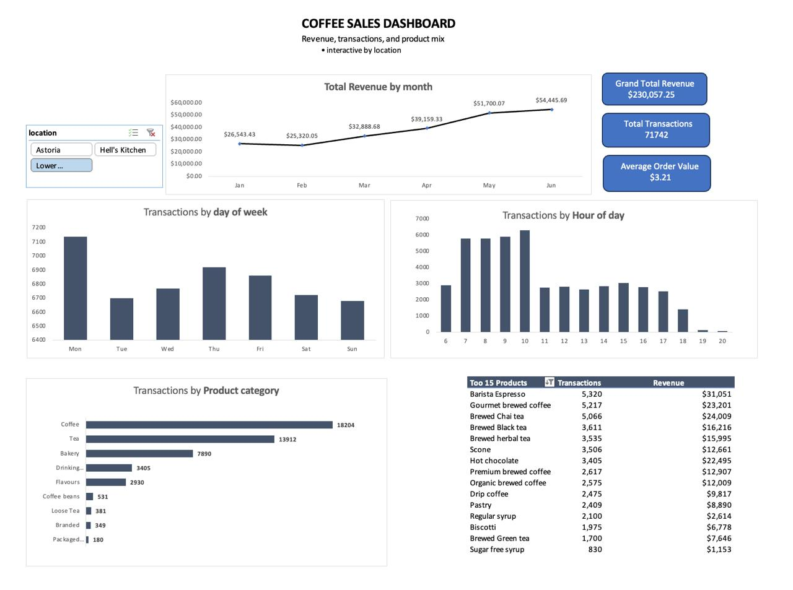

# Coffee Shop Sales Dashboard (Excel)

## 📌 Overview
This project demonstrates the end-to-end process of building an interactive Excel dashboard for a **coffee shop dataset**.  
The goal was to clean and prepare raw transactional data, analyze sales trends with PivotTables, and design a dynamic dashboard to uncover actionable business insights.  

---

## 🎯 Objectives & Steps

1. Prepare the Data for Analysis
- Conducted basic **data quality checks** (QA) and profiling on the coffee shop dataset.  
- Added calculated **date and time fields** (e.g., day of week, month, hour) for time-based analysis.  
- Ensured dataset was structured for pivot table exploration.  

2. Explore the Data with Pivot Tables
- Built multiple **PivotTables** to slice and dice the data.  
- Analyzed **time-series trends** (daily, monthly, hourly sales).  
- Explored **product-level performance** (top items, categories, revenue contribution).  

3. Build a Dynamic Dashboard
- Designed an **interactive Excel dashboard** using PivotCharts, slicers, and formatting.  
- Consolidated KPIs (total sales, top products, busiest times).  
- Highlighted actionable insights and recommendations for the coffee shop.  

---

## 🛠️ Skills & Tools Used
- **Excel**: Data cleaning, PivotTables, PivotCharts, Slicers  
- **Data Analysis**: Time-series analysis, product trend analysis  
- **Dashboard Design**: Layout planning, interactive elements, visualization best practices  

---

## 📂 Files in this Repository
- [Coffee_Shop_Dashboard.xlsx](Coffee_Shop_Dashboard.xlsx) → Interactive dashboard file  
- [Coffee_Shop_Dashboard.pdf](Coffee_Shop_Dashboard.pdf) → Static PDF version for quick viewing  
- [Coffee_Shop_Sales.xlsx](Coffee_Shop_Sales.xlsx) → Cleaned dataset used for the project  

---

## 📊 Dashboard Preview

*Interactive Excel dashboard showing sales KPIs, top products, and hourly performance.*

---

## ✅ Key Insights
- Identified **peak sales hours** (morning rush).  
- Highlighted **best-performing product categories** (e.g., coffee vs. bakery).  
- Recommended strategies to **optimize staffing and inventory** during peak times.  

---

## 🔗 Project Link
View the project on GitHub: [Coffee Shop Sales Dashboard](https://github.com/venmuhilbharathi-g/excel_dashboard_projects)  
